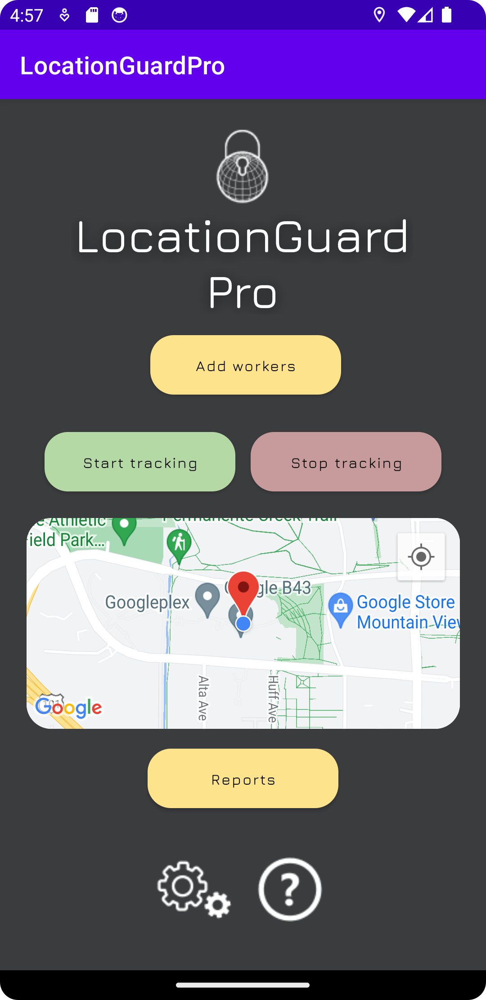
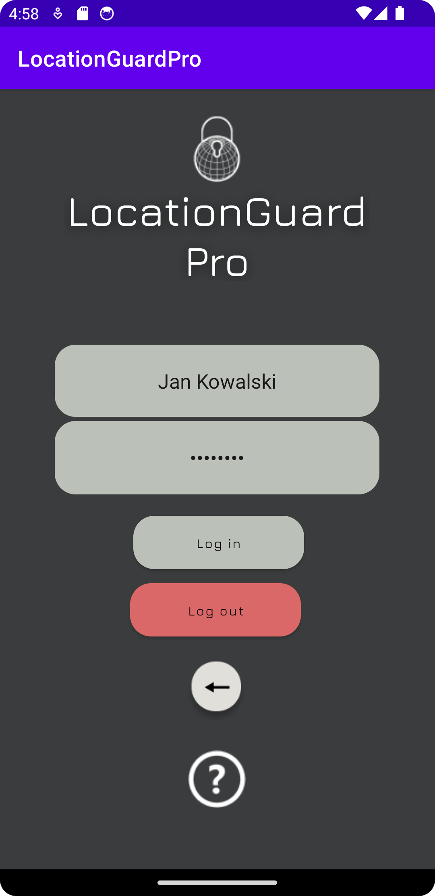
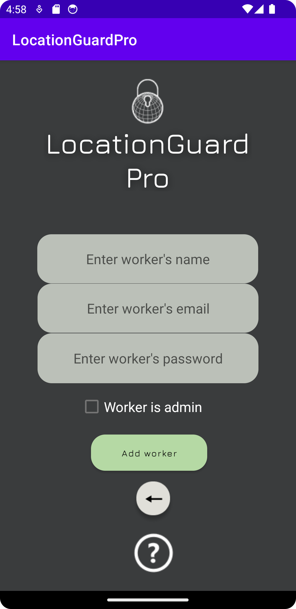
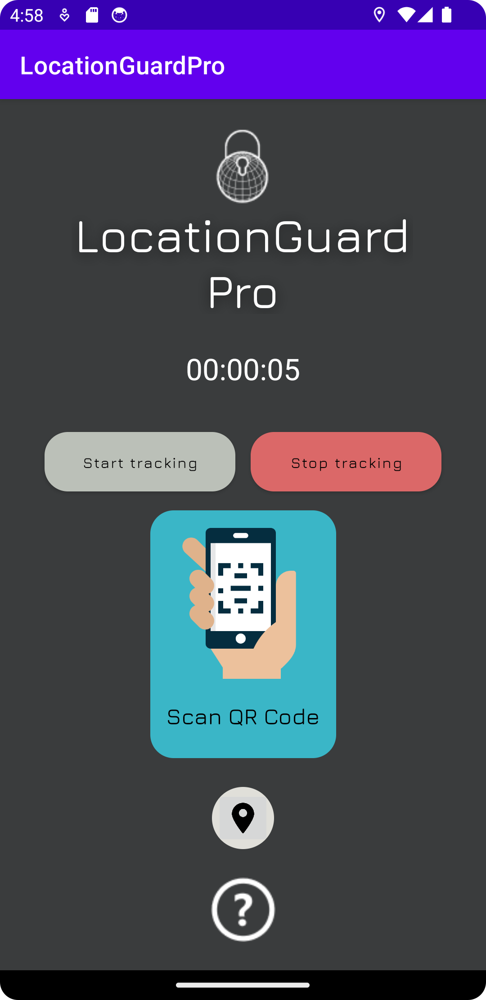
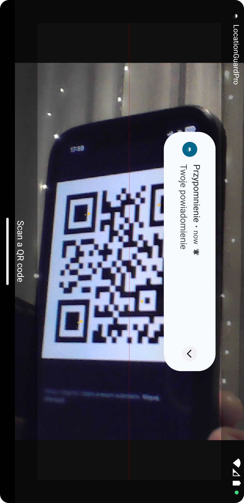
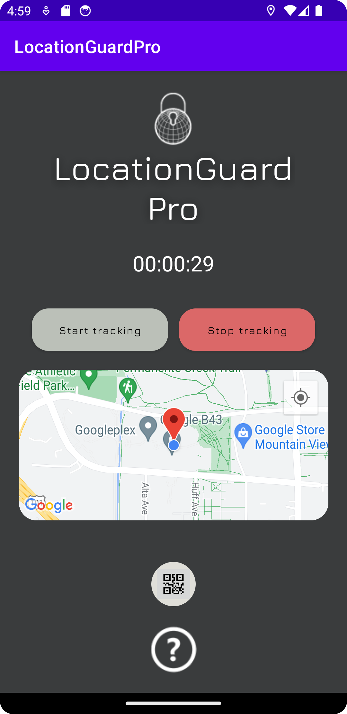
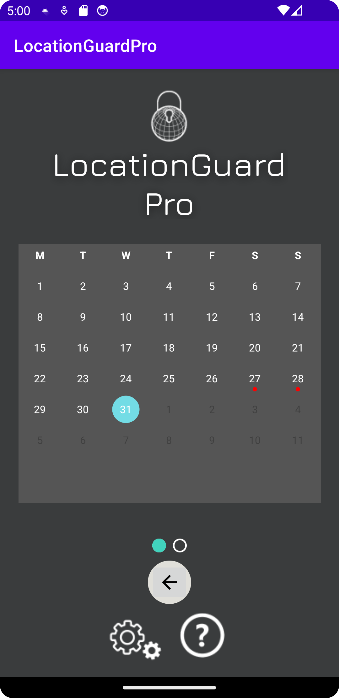
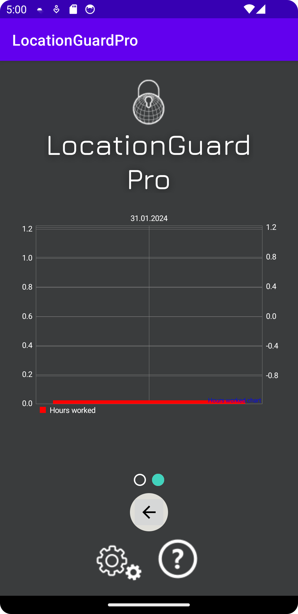
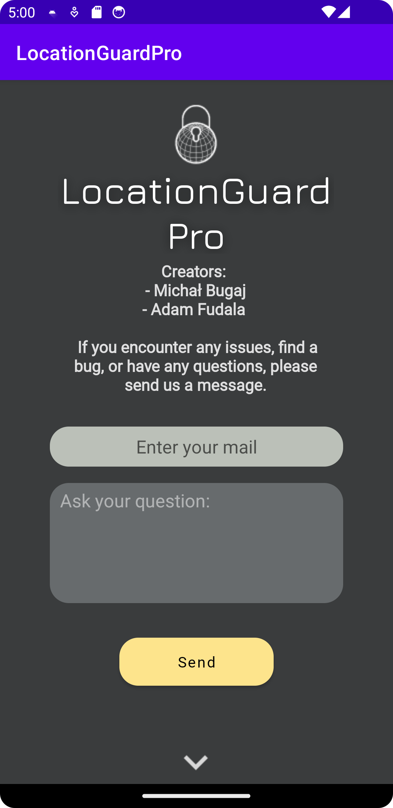

# Employee Control App 🕵️‍♂️📱

[**Pobierz plik APK**](APK/LocationGuardPro.apk?raw=true)

## Overview
The Employee Control App is a Kotlin-based Android application developed in Android Studio. It serves as a tool to monitor the location of employees in their workplace. The app ensures that employees are present at their designated locations during working hours.

<details open>
  <summary>Home</summary>
  
  
</details>

<details>
  <summary>Login Screen</summary>
  
  
</details>

<details>
  <summary>Add Employee</summary>
  
  
</details>

<details>
  <summary>Tracking QR</summary>
  
  
</details>

<details>
  <summary>Scan QR Code</summary>
  
  
</details>

<details>
  <summary>Tracking on Map</summary>
  
  
</details>

<details>
  <summary>Event Calendar</summary>
  
  
</details>

<details>
  <summary>Chart View</summary>
  
  
</details>

<details>
  <summary>Help Section</summary>
  
  
</details>


## Features

### User Authentication 🚀
- Secure user login functionality.
- Administrator account for managing user permissions.

### Time Tracking ⏰
- Start tracking button initiates work hours counting.
- Users can scan QR codes to continue counting work hours.
- Time tracking pauses if the user fails to scan within a specified time.

### Admin Controls 👩‍💼
- Administrator can add new users to the database.
- Grant or revoke admin privileges for individual users.

### QR Code Scanner 📷
- Users must scan QR codes at their workplace to continue tracking time.
- Correctly scanning the qr code adds the accrued hours to the database and resets the counter.

### Notification System 🔔
- Users receive timely notifications to remind them to scan QR codes.
- Administrators can set the notification lead time.

### Real-time Location Tracking 🗺️
- Google Maps integration for real-time tracking of user location.
- Future expansion potential for features like geofencing.
- **Note:** For the map functionality to work, insert your Google Maps API key in the appropriate location in the AndroidManifest.xml file.

### Reports Screen 📊
- Calendar displaying workdays with dots indicating the number of worked hours.
- Chart showing worked hours over the last week.
- Dots on the calendar are color-coded (red, orange, green) based on the worked hours.

## Getting Started 🚀

### Prerequisites
- Android Studio installed.
- Kotlin plugin added to Android Studio.

### Installation
1. Clone the repository.
   ```bash
   git clone https://github.com/your-username/employee-control-app.git

- Open the project in Android Studio.
- Build and run the application on an Android emulator or physical device.

## Future Enhancements 🌟
- Enhanced QR Code System: Restrict QR code scans to specific locations on the map.
- Extended Reporting: Generate detailed reports of employees' work hours.
- Geofencing: Set up geographical boundaries for employees.
  
Feel free to contribute to the development and make suggestions for improvements.

## Contributors 🤝
- Michał Bugaj
- Adam Fudala

## License 📝
This project is licensed under the MIT License - see the LICENSE file for details.
